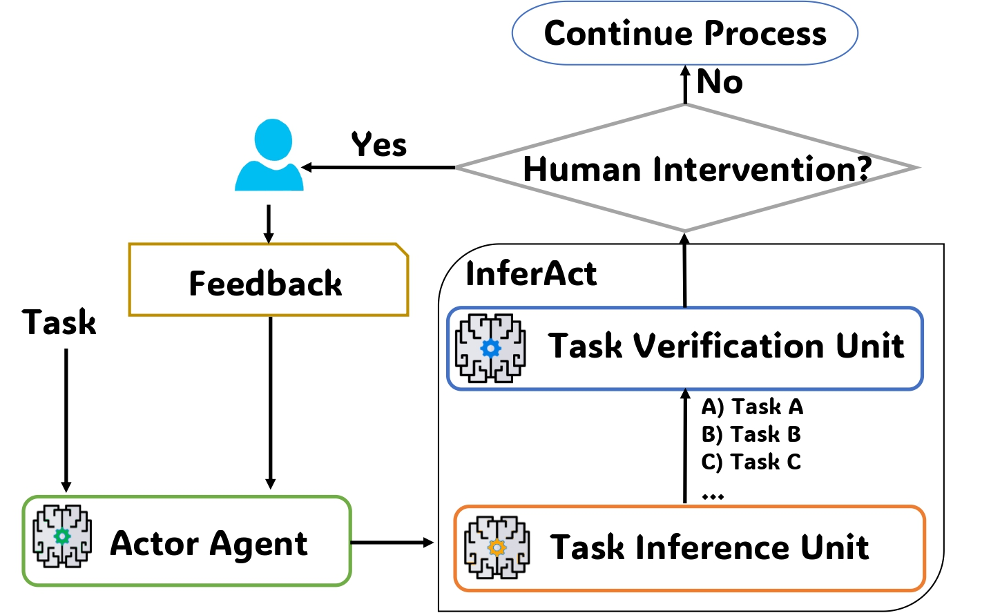

# InferAct: Inferring Safe Actions for LLMs-Based Agents Through Preemptive Evaluation and Human Feedback
[](https://put-here-your-paper.com)
[](https://opensource.org/licenses/Apache-2.0)
[](https://www.python.org/)

This repository implements the evaluation approach, InferAct, for LLM agents described in [InferAct: Inferring Safe Actions for LLMs-Based Agents Through Preemptive Evaluation and Human Feedback]() 

> **Abstract** :A crucial requirement for deploying LLM-based agents in real-life applications is the robustness against risky or even irreversible mistakes. However, the existing research lacks a focus on preemptive evaluation of reasoning trajectories performed by LLM agents, leading to a gap in ensuring safe and reliable operations.
To explore better solutions, this paper introduces InferAct, a novel approach that leverages the Theory-of-Mind capability of LLMs to proactively detect potential errors before critical actions are executed (e.g., *buy-now* in automatic online trading or web shopping).
InferAct is also capable of integrating human feedback to prevent irreversible risks as well as enhance the actor agent's decision-making process.
Experiments on three widely-used tasks demonstrate the effectiveness of InferAct. 
The proposed solution presents a novel approach and concrete contributions towards developing LLM agents that can be  safely deployed in different environments involving critical decision-making.

Contact person: [Haishuo Fang](mailto:haishuo.fang@tu-darmstadt.de) 

[UKP Lab](https://www.ukp.tu-darmstadt.de/) | [TU Darmstadt](https://www.tu-darmstadt.de/
)

Don't hesitate to send us an e-mail or report an issue, if something is broken (and it shouldn't be) or if you have further questions.





## 🚀 Setup
```sh
> python -m venv interact
> source ./inferact/bin/activate
> pip install -r requirements.txt
```

## 🛠️ Usage

### Run Actor
We adapt code for `ALFWorld`, `HotPotQA`, `WebShop` from the [Reflexion repository](https://github.com/noahshinn/reflexion)

To run the Actor agent in `ALFWorld` and `WebShop`, you need to configure the enviromments. Please refer to the original repository.

The Actor agent is reponsible for performing tasks in environments. `--run_agents` controls whether to run actor in different environments e.g. `--task webshop`.

```sh
> python main.py 
--run_agents 
--task webshop 
--trial_num 0
--feedback_type nl
```

### Run Evaluator
The evaluator evaluates the Actor trajectory before critical actions.

```sh
> python main.py --feedback_type nl
--model_name gpt4-turbo
--eval_method inferact
--task webshop
--trial_num 0
--threshold 0.9
--do_eval
```

- `--eval_method` specifies different evaluation methods.<br>
- `--threshold` specifies the threshold of F1-score for `multi-step evaluation` and `inferact`.<br>
- `--do_eval` controls whether to evaluate the Actor trajectory.<br>

### Run Feedback Generation

After the off-track trajectory is detected by the Evaluator, the binary or NL feedback will be generated to prevent the critial action from executing.

```sh
> python main.py
--model_name gpt4-turbo
--eval_method inferact
--task webshop
--trial_num 0
--threshold 0.9
--do_feedback_gen
--feedback_type nl
```
### Pipeline
To run different components in a pipeline, you can use 
```sh
> python main.py 
    --model_name gpt35-turbo
    --run_agents 
    --task hotpotqa
    --trial_num 0
    --feedback_type nl
    --eval_method standard
    --threshold 0.9 
    --do_eval 
    --do_feedback_gen
```


## Cite

Please use the following citation:

```
@InProceedings{smith:20xx:CONFERENCE_TITLE,
  author    = {Smith, John},
  title     = {My Paper Title},
  booktitle = {Proceedings of the 20XX Conference on XXXX},
  month     = mmm,
  year      = {20xx},
  address   = {Gotham City, USA},
  publisher = {Association for XXX},
  pages     = {XXXX--XXXX},
  url       = {http://xxxx.xxx}
}
```

## Disclaimer

> This repository contains experimental software and is published for the sole purpose of giving additional background details on the respective publication. 
